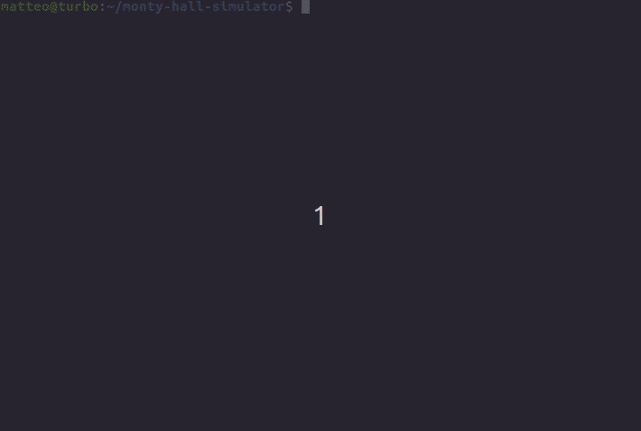

# Monty Hall Problem simulator

This is a simple *Monty Hall Problem* simulator that I wrote for fun. It
allows you to choose how many "games" to play, how many doors to have and if you
want to switch doors when asked by the presenter.

But what is the *Monty Hall Problem* anyway? Here is an excerpt from
Wikipedia:
>The Monty Hall problem is a brain teaser, in the form of a probability puzzle, loosely based on the American television game show Let's Make a Deal and named after its original host, Monty Hall. The problem was originally posed (and solved) in a letter by Steve Selvin to the American Statistician in 1975
[...]
Suppose you're on a game show, and you're given the choice of three doors:
Behind one door is a car; behind the others, goats. You pick a door, say No. 1,
and the host, who knows what's behind the doors, opens another door, say No. 3,
which has a goat. He then says to you, "Do you want to pick door No. 2?"
Is it to your advantage to switch your choice?
(from: https://en.wikipedia.org/wiki/Monty_Hall_problem)

Here is a quick demo:


## Install
The only (optional) requirement is the `prettytable` package, which allows the script to print a table with the details of the simulation. To install it using `pip`, use this command:
```bash
pip install prettytable
```

## Usage
Usage is pretty straightforward: just run the script with ```./monty-hall.py``` or ```python3 monty-hall.py```. This will output something similar to this:
```
Monty Hall Problem simulator: 3 doors, 20 runs, switch door: no

Simulation details:
+-------+--------------+-------+-------+-------+------+
| run # | Switch door? | Door1 | Door2 | Door3 | Win? |
+-------+--------------+-------+-------+-------+------+
|   1   |      No      |   GL  |   WS  |   GP  |  No  |
|   2   |      No      |   GL  |   GP  |   WS  |  No  |
|   3   |      No      |   GP  |   GL  |   WS  |  No  |
|   4   |      No      |   GL  |   WP  |   GS  | Yes  |
|   5   |      No      |   WS  |   GP  |   GL  |  No  |
|   6   |      No      |   GS  |   GL  |   WP  | Yes  |
|   7   |      No      |   GP  |   GL  |   WS  |  No  |
|   8   |      No      |   WS  |   GL  |   GP  |  No  |
|   9   |      No      |   WP  |   GS  |   GL  | Yes  |
|   10  |      No      |   GL  |   GP  |   WS  |  No  |
|   11  |      No      |   GP  |   WS  |   GL  |  No  |
|   12  |      No      |   WP  |   GL  |   GS  | Yes  |
|   13  |      No      |   WS  |   GL  |   GP  |  No  |
|   14  |      No      |   WS  |   GL  |   GP  |  No  |
|   15  |      No      |   WS  |   GP  |   GL  |  No  |
|   16  |      No      |   GL  |   WP  |   GS  | Yes  |
|   17  |      No      |   GL  |   WP  |   GS  | Yes  |
|   18  |      No      |   GL  |   WP  |   GS  | Yes  |
|   19  |      No      |   WS  |   GP  |   GL  |  No  |
|   20  |      No      |   GL  |   WS  |   GP  |  No  |
+-------+--------------+-------+-------+-------+------+
Legend:
  G: goat
  W: winning door
  P: door chosen by the player
  L: goat door chosen by the presenter
  S: proposed door by the presenter for the switch.

Summary: wins=7 losses=13 (win rate is 35.0 %)
```
Optionally, you can specify some arguments:
```
--doors: change the number of doors.
--switch: switch to the door proposed by the presenter.
--runs: number of "games" to play.
```

You will notice that by forcing a door switch (via the `--switch` parameter) the win rate will increase.

## License
BSD 3-Clause License